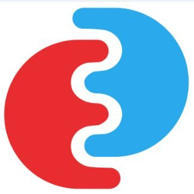

# EOEPCA+ Resource Registration Building Block

<!-- PROJECT SHIELDS -->
<!--
*** See the bottom of this document for the declaration of the reference variables
*** for contributors-url, forks-url, etc. This is an optional, concise syntax you may use.
*** https://www.markdownguide.org/basic-syntax/#reference-style-links
-->

[![Issues][issues-shield]][issues-url]
[![MIT License][license-shield]][license-url]

<!-- PROJECT LOGO -->
 

  

  <h3 align="center">EOEPCA+ Resource Registration</h3>

  

    This repository includes the documentation of the EOEPCA+ Resource Registration building block
     
    <a href="https://eoepca.readthedocs.io/projects/resource-registration/en/latest/"><strong>Explore the docs »</strong></a>
     
  

<!-- TABLE OF CONTENTS -->

<!-- ABOUT THE PROJECT -->

## Description

The EOEPCA+ Resource Registration building block consists of the following components:

- Registration API - [https://github.com/EOEPCA/registration-api](https://github.com/EOEPCA/registration-api)
- Registration Harvester - [https://github.com/EOEPCA/registration-harvester](https://github.com/EOEPCA/registration-harvester)
- Common Registration Library - [https://github.com/EOEPCA/registration-library](https://github.com/EOEPCA/registration-library)

The building block is built with and based on the following tools and standards.

- [Python](https://www.python.org/)
- [pygeoapi](https://pygeoapi.io/)
- [OGC API Processes](https://ogcapi.ogc.org/processes/)
- [Flowable](https://www.flowable.com/open-source)
- [FastAPI](https://fastapi.tiangolo.com/)
- [OMG Business Process Model and Notation (BPMN)](https://www.bpmn.org)

## Getting Started

## Documentation

The building block documentation can be found [here](https://eoepca.readthedocs.io/projects/resource-registration/en/latest/).

<!-- LICENSE -->

## License

The EOEPCA building blocks are distributed under the Apache-2.0 License. See `LICENSE` for more information.

<!-- CONTACT -->

## Contact

Project Link: [https://github.com/EOEPCA/resource-registration](https://github.com/EOEPCA/resource-registration)

<!-- ACKNOWLEDGEMENTS -->

## Acknowledgements

- README.md is based on [this template](https://github.com/othneildrew/Best-README-Template) by [Othneil Drew](https://github.com/othneildrew).

<!-- MARKDOWN LINKS & IMAGES -->
<!-- https://www.markdownguide.org/basic-syntax/#reference-style-links -->

[contributors-shield]: https://img.shields.io/github/contributors/EOEPCA/resource-registration.svg?style=flat-square
[contributors-url]: https://github.com/EOEPCA/resource-registration/graphs/contributors
[forks-shield]: https://img.shields.io/github/forks/EOEPCA/resource-registration.svg?style=flat-square
[forks-url]: https://github.com/EOEPCA/resource-registration/network/members
[stars-shield]: https://img.shields.io/github/stars/EOEPCA/resource-registration.svg?style=flat-square
[stars-url]: https://github.com/EOEPCA/resource-registration/stargazers
[issues-shield]: https://img.shields.io/github/issues/EOEPCA/resource-registration.svg?style=flat-square
[issues-url]: https://github.com/EOEPCA/resource-registration/issues
[license-shield]: https://img.shields.io/github/license/EOEPCA/resource-registration.svg?style=flat-square
[license-url]: https://github.com/EOEPCA/resource-registration/blob/master/LICENSE
