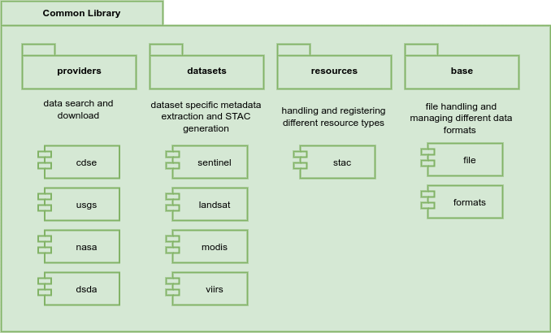

# Common Library

The Resource Registration BB Common Library is workflow engine independent Python library, which combines and consolidates the functionalities of various upstream packages currently used in different EO data workflow systems. This library is used to implement the business logic of the individual workflow steps as well as the handling of the different resource types in the Registration API and the workflows. It embeds the Data Gateway BB, which provides a singular semantic to search and access data across all BBs.

The library will be designed in a modular architecture so that workflow developers have to include only the functionality they actually need. The implementation of the library will provide Python modules to:

- Harvest metadata from endpoints with different API specifications. At least, STAC, OGC Records and OGC OpenSearch will be supported
- Extract metadata from different datasets
- Perform data conversion operations (e.g. reformatting, COG generation, etc.)
- Perform basic data operations like download, unzip, etc.

The following diagram show the initial design of the library. The packages and modules are designed with respect to the requirements of the initial Harvester workflows, which are provided with the Registration BB.

The Common Library uses the following upstream packages:

- [PySTAC](https://github.com/stac-utils/pystac) is a library for working with the SpatioTemporal Asset Catalog specification in Python 3. PySTAC was used in EOEPCA within the Harvester and Registrar components.
- [stactools](https://github.com/stac-utils/stactools) is a high-level command line tool and Python library for working with STAC. A suite of packages exists for working with a variety of datasets.
- [EOMetadataTool](https://github.com/dlr-eoc/EOmetadataTool) is a library for a table controlled EO metadata extractor creating STAC metadata from multiple data formats (e.g., zip, gzip, tar, SAFE, netCDF or directory tree).
- [EODAG](https://eodag.readthedocs.io/en/stable/index.html) is a Python package for searching and downloading EO data from different providers and APIs while offering a unified API for the user.

