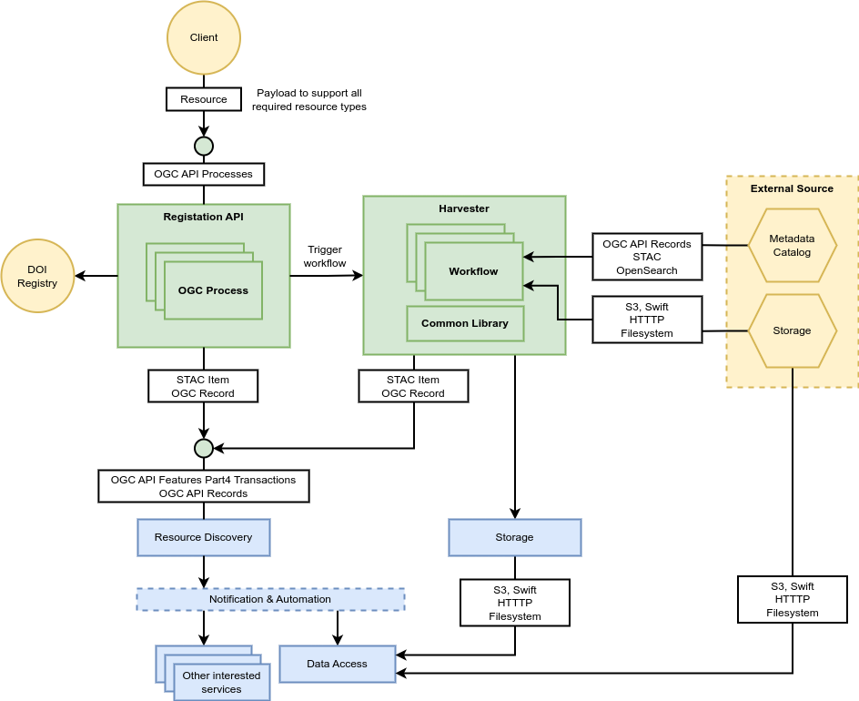
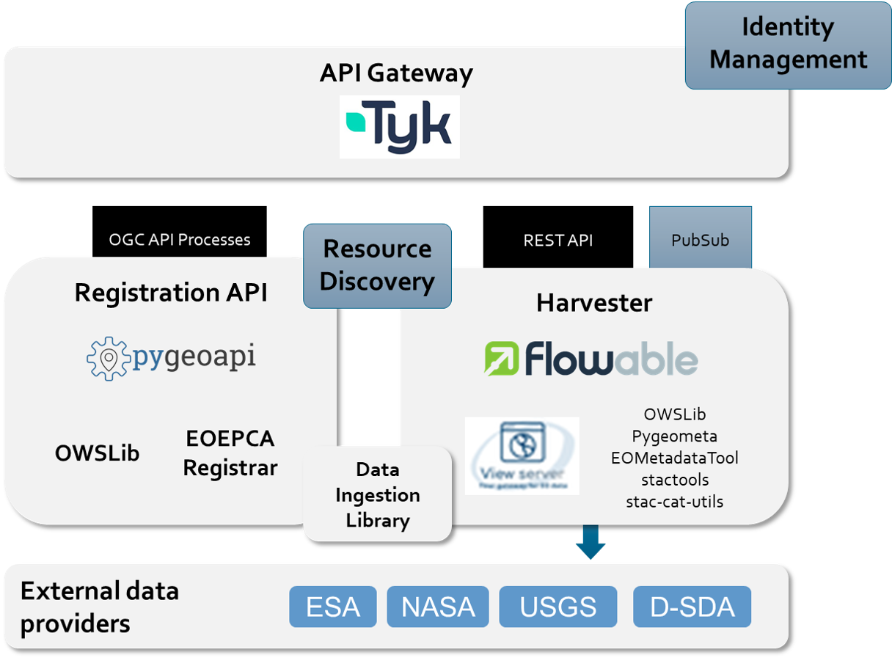

# Architecture

The Resource Registration Building Block supports the ingestion of data and its associated metadata into the platform services – including, but not limited to:

- Metadata registration into Resource Discovery service
- Data registration into Data Access services for data retrieval and visualisation

The Resource Registration BB is a companion to Resource Discovery in terms of satisfying the ingestion of the resource types supported by Resource Discovery. Thus, it provides a RESTful service interface for registration of all the Resource Types supported by the Resource Discovery Building Block.

The proposed architecture for the building block is presented in the following figure. Compared to the design originally presented in the [System Architecture document](https://eoepca.readthedocs.io/projects/architecture/), the following changes are introduced to fit the Resource Registration well into the overall architecture of the building blocks:

- Use OGC API Processes instead of OGC API Features Part 4 – Transactions for the Registration API as most of the resource types are not features (e.g., workflows, Jupyter Notebooks, EO Application Packages)
- Use the CRUD interface of Resource Discovery directly rather than publish a message to the Notification & Automation BB as the user of the API directly expect a result synchronously (however messages are asynchronously and usually no feedback is given to the originator). The Resource Discovery component will then publish a message to the Notification & Automation BB so that other building blocks can be notified about a resource registration.

As described in the [System Architecture document](https://eoepca.readthedocs.io/projects/architecture/) the Resource Registration Building Block includes the following main components:

* **Registration API** 
  For record Create, Update and Delete operations. The API is based on OGC standards for the registration of records into the platform. For the simple cases that a resource is already in the appropriate format (STAC, Record, ISO 19115, Dublin Core) the OGC API Features Part 4 (Create, Replace, Update and Delete - Transactions) is used to register those resources. In cases where transformation/validation needs to take place, an OGC API - Processes interface is defined for registering the appropriate resources.

* **Harvester** 
  To continuously ingest resources from other (external) data sources. The Harvester proactively initiates and orchestrates the harvesting capability and executes dedicated workflows to handle specific data sources. A workflow is a self-contained asset which can be deployed ("plugged") into the harvester and can therefore conceptionally be seen as a *Harvester Data Sources* mentioned in the System Architecture document.

* **Common Library** 
  The common library combines the functionalities of various upstream packages currently used in different EO data workflow systems. This library is used to implement the business logic of the individual workflow steps as well as  the handling of the different resource types in the Registration API and the workflows. It embeds the Data Gateway BB, which provides a singular semantic to search and access data across all BBs.

The components design of the Resource Registration Building Block is shown in the next figure. 

The Registration API uses pygeoapi to publish processes according to the OGC API Processes specification. Processes for resource creation, update, and deletion are implemented for all resource types available in the resource catalogue. The processes make use of the OWSLib, components of the EOEPCA registrar as well as the newly combined and developed data ingestion library.

The Harvester component is built with workflows in Camunda allowing to easily operate the workflows conducted. Python is used to communicate with the Camunda core engine via REST API and to execute the workflow steps. The execution of the tasks for metadata harvesting, data download, and metadata creation is based on various software, such as EOX View Server’s harvester as well as OWSLib, pygeometa, EOMetadataTool, and stactools. A common data ingestion library is being developed to combine the functionalities from those various packages.

As part of the workflows in Camunda, notifications can be sent to the notification & automation building block and workflows can listen for notifications as well.

All APIs are protected with the API Gateway, which connects to the Identity Management building block for authentication and authorization. In addition, the API Gateway is able to conduct rate-limiting.
