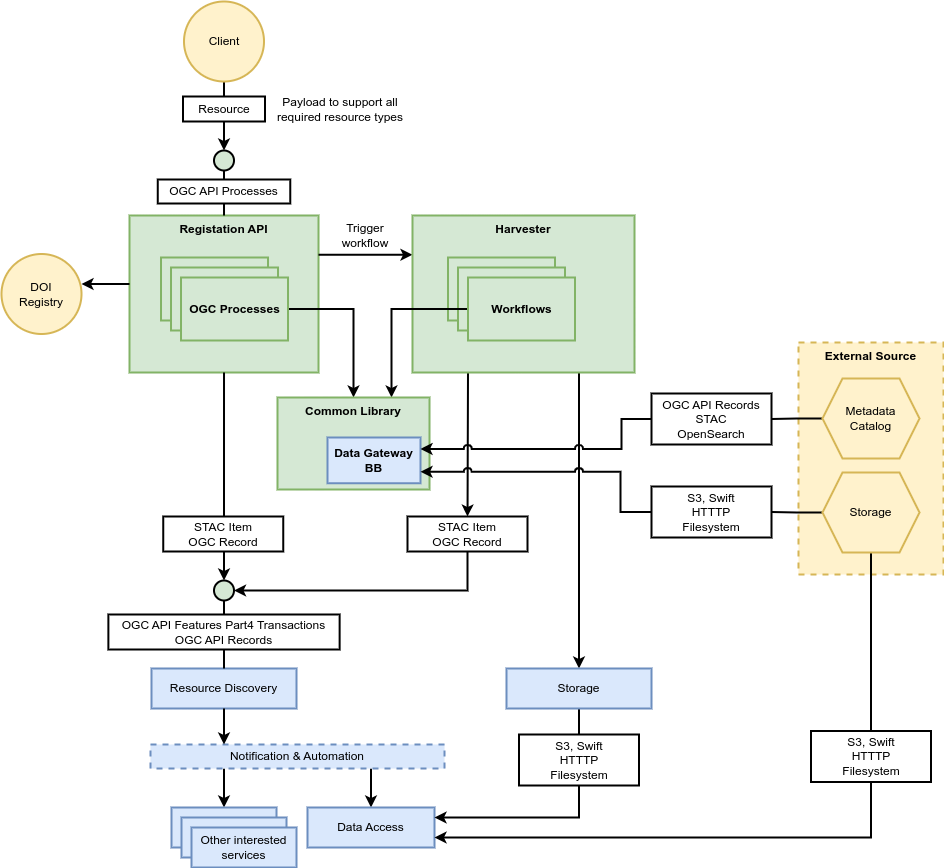

# Architecture

Subcomponent architecture and interfaces.
Resource Registration supports the ingestion of data and its associated metadata into the platform services – including, but not limited to:

- Metadata registration into Resource Discovery service
- Data registration into Data Access services for data retrieval and visualisation

The Resource Registration building-block is a companion to Resource Discovery in terms of satisfying the ingestion of the resource types supported by Resource Discovery. Thus, it provides a RESTful service interface for registration of all the Resource Types supported by the Resource Discovery Building Block.

As described in the [System Architecture document](https://eoepca.readthedocs.io/projects/architecture/) the Resource Registration Building Block includes the following components:

* **Registration API** 
  For record Create, Update and Delete operations. The API is based on OGC standards for the registration of records into the platform. For the simple cases that a resource is already in the appropriate format (STAC, Record, ISO 19115, Dublin Core) the OGC API Features Part 4 (Create, Replace, Update and Delete - Transactions) is used to register those resources. In cases where transformation/validation needs to take place, an OGC API - Processes interface is defined for registering the appropriate resources.

* **Harvester** 
  To ingest records from other (external) data sources. The Harvester proactively initiates and orchestrates the harvesting capability, and uses Harvester Data Source implementation to handle specific data sources.

* **Harvester Data Source(s)** 
  Provides an integration with a specific data source to provide customised support for record harvesting and interpretation. Designed to be plugged-in to the Harvester for a given deployment. Harvesting is supported from the following sources for metadata: OGC API Records, STAC (static), Opensearch. for registration of data assets the following sources are supported: S3 object storage, HTTP, Filesystem, Swift object storage.

The components design of the Resource Registration Building Block is shown in the next figure. Two main components are provided as part of the building block:

1. The Registration API and
2. the Harvester.

The Registration API uses pygeoapi to publish processes according to the OGC API Processes specification. Processes for resource creation, update, and deletion are implemented for all resource types available in the resource catalogue. The processes make use of the OWSLib, components of the EOEPCA registrar as well as the newly combined and developed data ingestion library.

The Harvester component is built with workflows in Camunda allowing to easily operate the workflows conducted. Python is used to communicate with the Camunda core engine via REST API and to execute the workflow steps. The execution of the tasks for metadata harvesting, data download, and metadata creation is based on various software, such as EOX View Server’s harvester as well as OWSLib, pygeometa, EOMetadataTool, and stactools. A common data ingestion library is being developed to combine the functionalities from those various packages.

As part of the workflows in Camunda, notifications can be sent to the notification & automation building block and workflows can listen for notifications as well.
All APIs are protected with the API Gateway, which connects to the Identity Management building block for authentication and authorization. In addition, the API Gateway is able to conduct rate-limiting.

## Harvester Data Sources / Workflows

As described in the overall building block architecture, the concept of the Harvester Data Source is represented by a Harvester workflow implementation. The inital set of Harvester Data Sources / Workflows is provided here. With DLR terrabyte as an operational platform for the Registration building block, this selection is primarily driven by the data requirements of the terrabyte users.

### Sentinel-1 SLC/GRD, Sentinel-2 L1C/L2A

| | |
| ---------| ---- |
| Provider | CDSE |
| API | OData https://datahub.creodias.eu/odata/v1 |
| Search Parameters | `PublicationDate`, `Online`, `Name` with `$expand=Attributes` option |
| Download | S3 (urls are retrieved from search results) |

### Landsat

| | |
| ---------| ---- |
| Provider | USGS |
| API      | STAC https://landsatlook.usgs.gov/stac-server |
| Search Parameters | `created` timestamp with [STAC API Query extension](https://github.com/stac-api-extensions/query) |
| Download | Utilization of [USGS M2M](https://m2m.cr.usgs.gov/) service to retrieve download URLs |

### MODIS

| | |
| ---------| ---- |
| Provider | NASA |
| API | CMR Search https://cmr.earthdata.nasa.gov/search/granules |
| Search Parameters | `production_date`, `updated_since` |
| Download | NASA DAAC |

### Other

The Resource Registration BB is extensible for other datasets and providers, that need to be integrated for harvesting. In general, Harvester Data Sources / Workflows will support the following metadata sources for harvesting:
- OGC API Records
- STAC
- OpenSearch
- OData?

Downloading will be supported from the following sources:
- S3 object storage
- HTTP
- Filesystem
- Swift object storage
