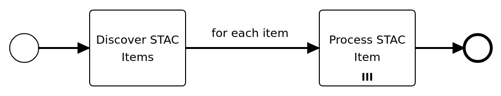

# Harvester Developer Guide

## Overview

This tutorial will guide you through the process of designing, implementing and executing a workflow with the Harvester component of the Resource Registration building block. In particular, you will learn

- how to design a workflow with BPMN using the Flowable Design tool, 
- how to implement a worker for it in Python and
- how to deploy and run the workflow.

## Example Workflow

The step-by-step procedures in this tutorial will develop a workflow, which represents the common use case of searching a STAC API and processing the STAC items contained in the search result. The graphical BPMN representation of this workflow can be ssen in figure below. 

The tutorial is split into three parts. 

1. [Workflow design with BPMN](harvester-tutorial-part1.md)
   - In this part you will create the BPMN representation of the workflow shown above. The result of this will be an XML file containing the BPMN model. If you want to skip the modeling part, the final BPMN model can be downloaded [here](../img/harvester-tutorial/example-workflow.bpmn).
2. [Worker implementation with Python](harvester-tutorial-part2.md)
   - In this part, the worker will be implemented which contains the logic to be executed for each part of the workflow.
3. [Deployment and workflow execution](harvester-tutorial-part3.md)
   - Finally, the BPMN workflow model and the worker implementation will be deployed and the workflow will be executed.
