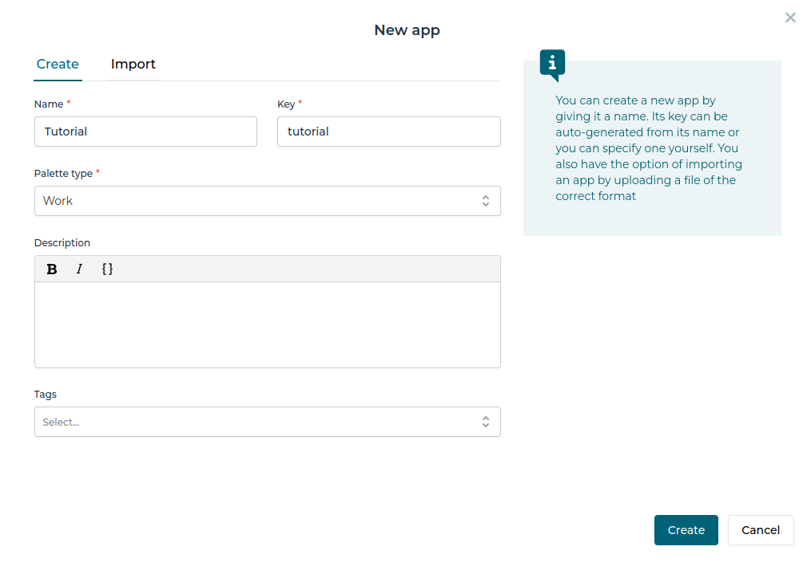
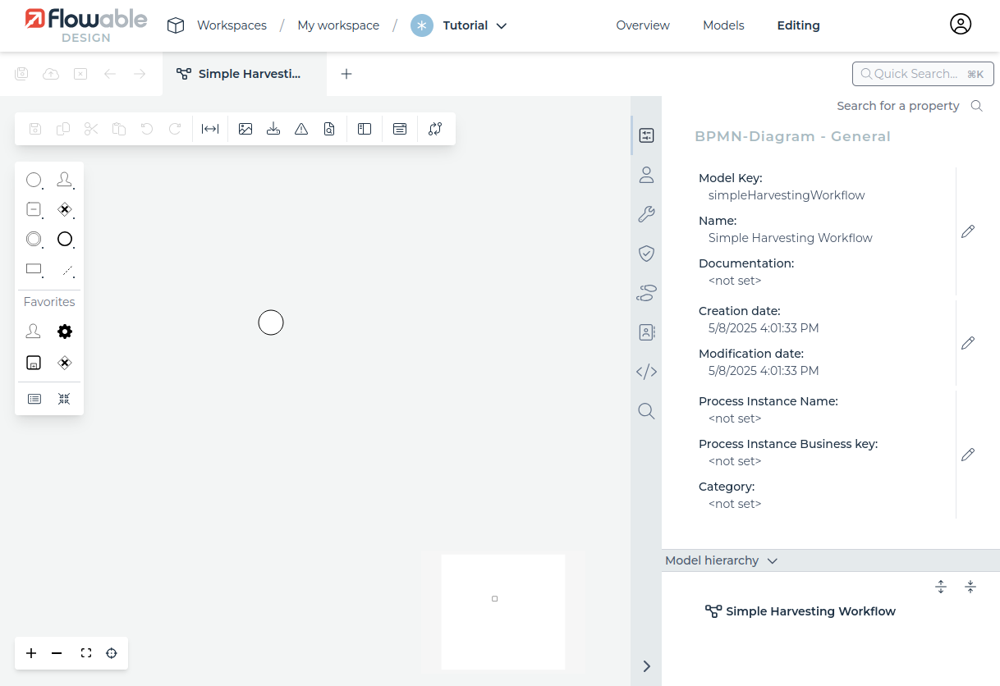
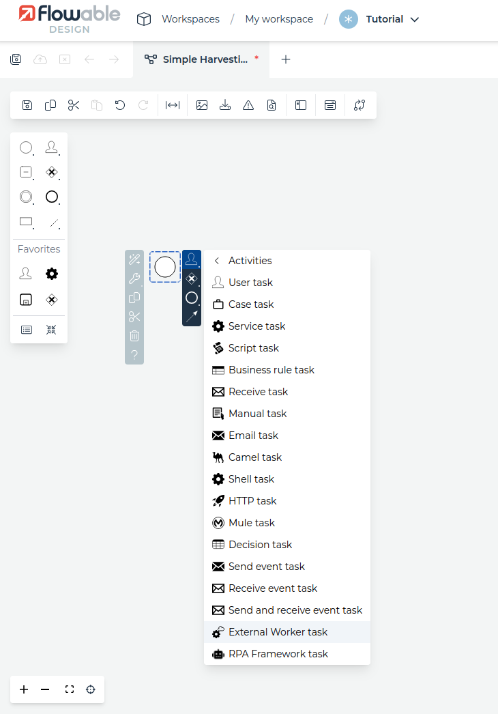

# Harvester Tutorial: Part 1

## Workflow design with BPMN

### Flowable Design
   
- Login to Flowable Design
- First we must create a new app. Click the red "Create" button and fill the form as shown below and click "Create"

- Next we will create our first BPMN model. Click the red "Create" button and fill the form as shown below. Important is that we choose *Process* as Model Type here.

- No we are in the BPMN editor and can start drawing our workflow model. If not shown, make sure that the Properties panel is visible on the right side. Your workspace should now look like as shown below:

- As you see, there is already a BPMN Start Event present. 

 
- Save to file
- We will utilize the Flowable REST API to deploy the workflow.