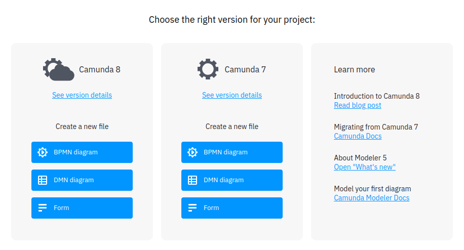
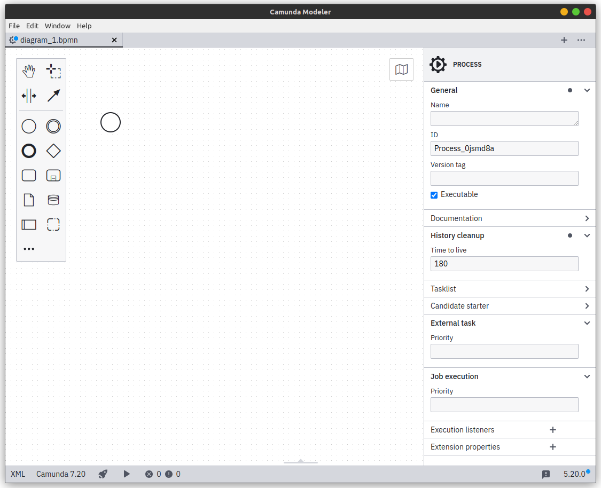
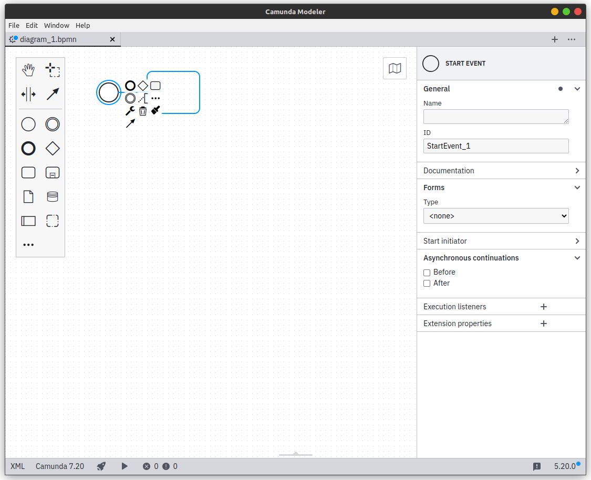
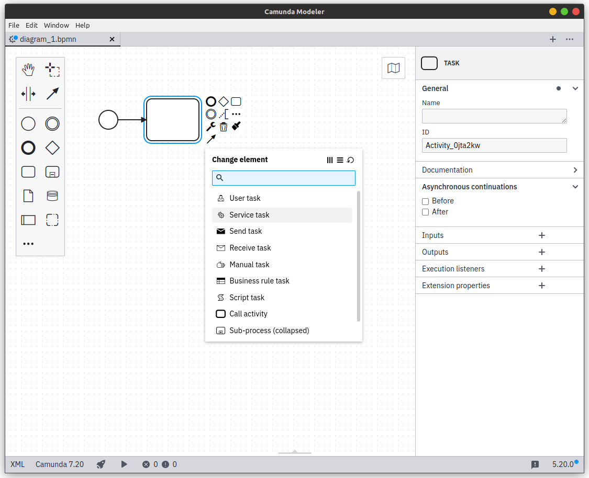
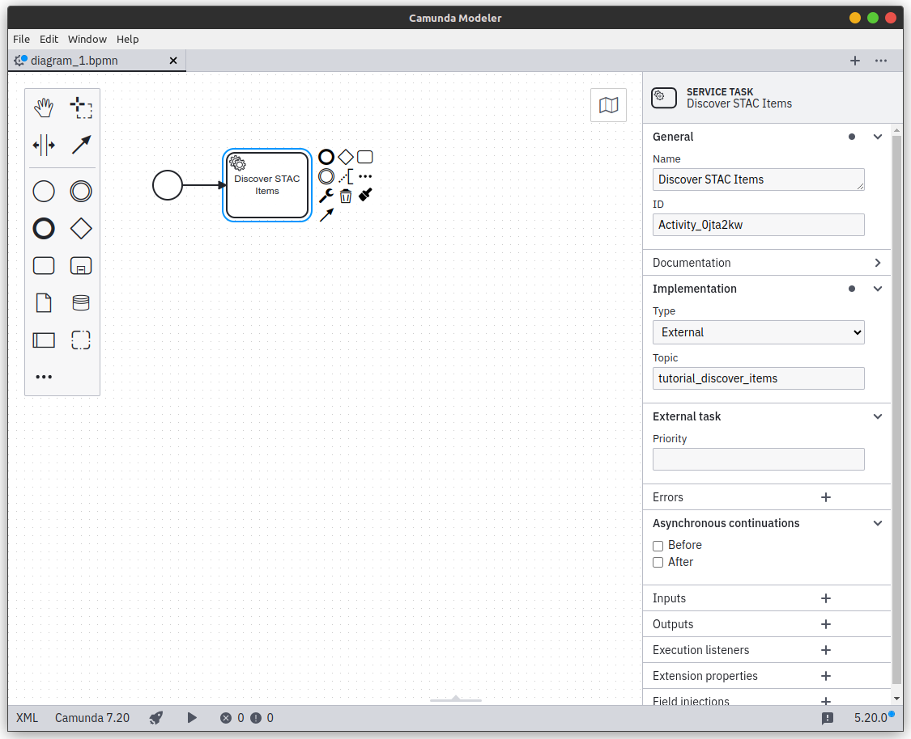
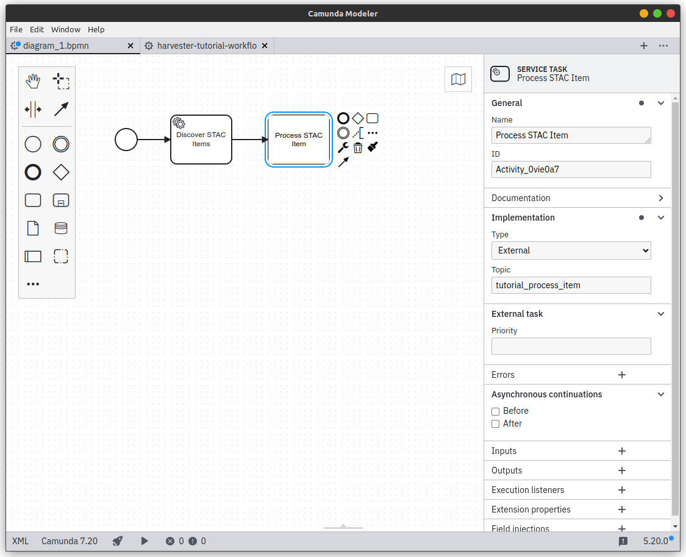
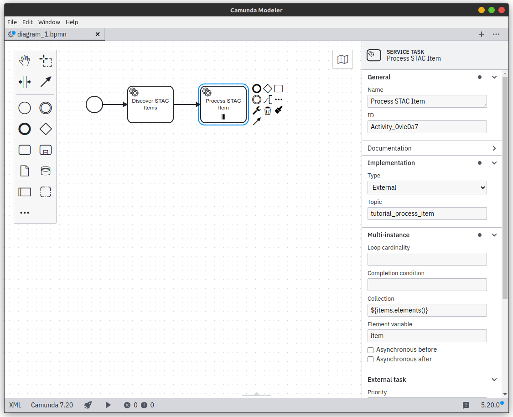
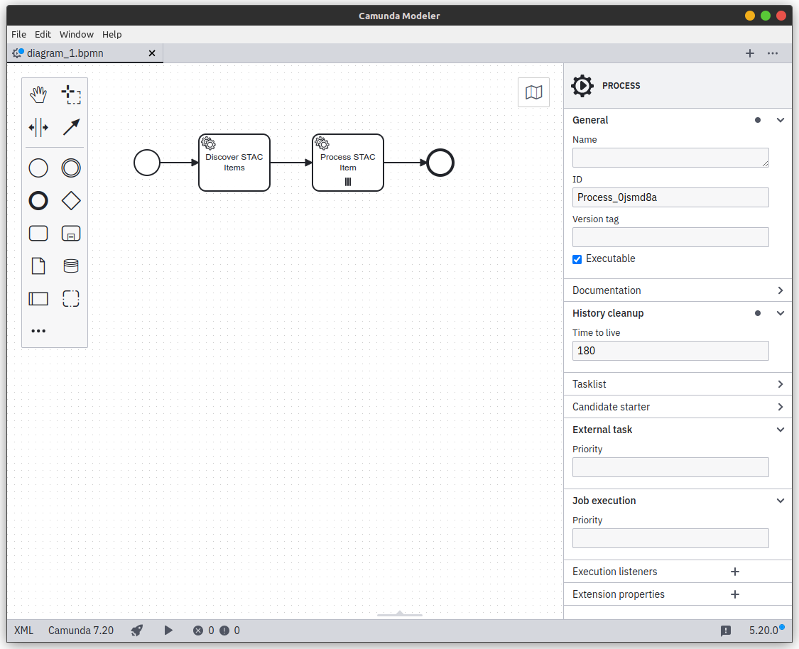
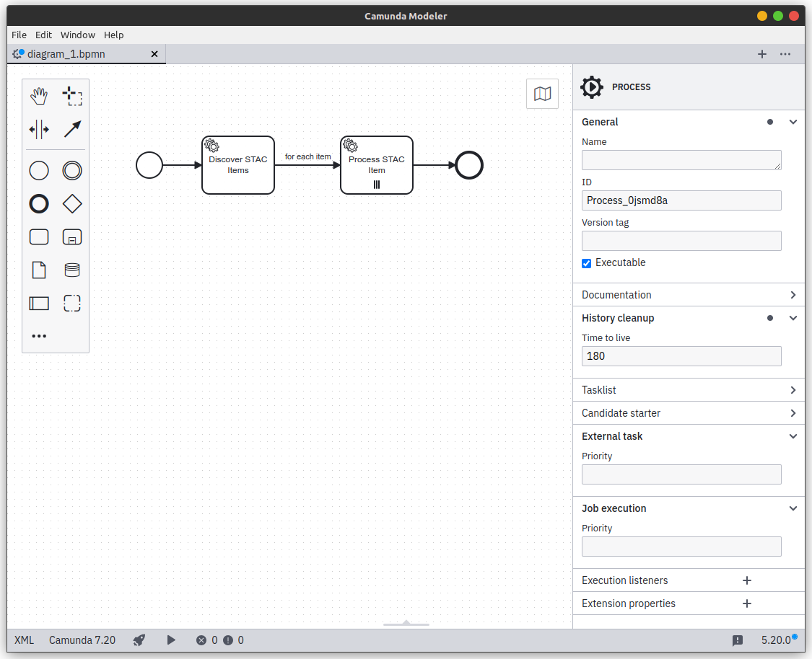

# Harvester Developer Guide Part 1 - Workflow design with BPMN

1. Open the [Camunda Modeler](https://camunda.com/download/modeler/) application. If you haven't used it before you will need to download and install it.

1. Next we will create our first BPMN model. Our model needs to be compatible to Camunda 7 so click the "BPMN diagram" button in the Camunda 7 section. 

    

2. No we are in the BPMN editor and can start drawing our workflow model. If not shown, make sure that the Properties panel is visible on the right side. Your workspace should now look like as shown below:

    

3. As you can see, there is already a BPMN Start Event present so that we can start creating the first step of the workflow. Select the start event and in the apearing menu click on the rounded rectange symbol. This will append a new Task to the workflow.

    

4. Select the new task, in the appearing menu select the tool symbol "Change element" and change to element type to "Service task". 

    

5. In the properties panel on the right
   - update the Name field,
   - select "External" for the Implementation Type and
   - set a Topic name as show in picture below. The topic name will later represent a queue in the BPMN engine, from which our worker implementation (see part 2) will fetch its tasks for this workflow step.
    
    

5. We have just defined the discovery step of the workflow. Later in the worker implementation we will specify, how the actual STAC search is executed. For the further workflow definition we now have to consider, that the output of this discovery step will be a list of objects, in this case STAC items, and that we want to iterate through this list and perform an action on every item. To define this behaviour in BPMN we create another Service Task and utilize the multi-instance capability of BPMN.

6. Select the previously created "Discover STAC Items" task and append another task, just like we did it above. In the properties panel update Name, Implementation Type and set the Topic name as show in picture below.

    

7. Now select the new task and in the appearing menu select the tool symbol "Change element". In the top right corner of the menu click on the symbol representing three parallel lines to make this task a "Parallel multi-instance" task. Now the three parallel lines symbol is visible in the task below the name. Also, in the properties panel a new section "Multi-instance" has been added which must be filled as shown below. When executing the workflow, the BPMN engine will now create a dedicated instance of this task for each element in the list of our search results. We defined, that the name of the list will be "items" and that each element should be made available to each task in a variable of name "item". How the variables "items" and "item" are created and handed between the workflow task will be specified in the worker implementation.

    

8.  Now we have defined the step of the workflow where each item of our search result is processed. The actual processing will also be specified in the workflow implmentation.  

9.  Finally we need to add an End event to the workflow so that the BPMN engine knows that no other tasks need to be executed in the workflow. Select the previously created "Process STAC Item" task and in the menu click the black circle icon to add an end event to the workflow. 

    

10. To improve the readability of the workflow model, we can add a comment on the flow connecting our two task. For this, click on the arrow connecting both tasks and update the Name property in the properties panel. The final workflow model should look like this:

    

11. At the end we need to save our model to file, as we will it need to deploy the workflow in our Operaton instance later to be able to run it. In the toolbar of the editor "File" -> "Save File As" to save the file as `harvester-tutorial-workflow.bpmn` to your local file system.
