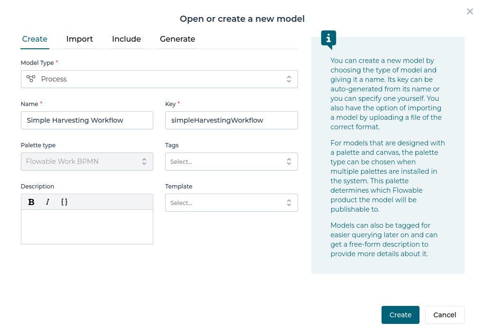

# Harvester Developer Guide Part 1 - Workflow design with BPMN

## Flowable Design
   
1. Login to [Flowable Design](https://trial.flowable.com/design/). If you haven't used it before you will need to register yourself. The registration and usage of the tool is free.

1. First we must create a new app. Click the red "Create" button and fill the form as shown below and click "Create"

    

1. Next we will create our first BPMN model. Click the red "Create" button and fill the form as shown below. Important is that we choose *Process* as Model Type here.

    

1. No we are in the BPMN editor and can start drawing our workflow model. If not shown, make sure that the Properties panel is visible on the right side. Your workspace should now look like as shown below:

    

1. As you can see, there is already a BPMN Start Event present so that we can start creating the first step of the workflow. Select the start event, click the "FormTask" icon and from the Activities submenu choose "External Worker tasks". 

    

1. A new activity is added to the workflow. Open the properties panel on the right and update the Name and Job topic properties as show in picture below. The job topic parameter will later represent a queue in the BPMN engine, from where our worker implementation (see part 2) will fetch its jobs for this workflow step.

    

1. We have just defined the discovery step of the workflow. Later in the worker implementation we will specify, how the actual STAC search is executed. For the further workflow definition we now have to consider, that the output of this discovery step will be a list of objects, in this case STAC items, and that we want to iterate through this list and perform an action on every item. To define this behaviour in BPMN we create another External Worker task and utilize the multi-instance capability of BPMN.

1. Select the previously created "Discover STAC Items" activity, click the "FormTask" icon and from the Activities submenu choose "External Worker tasks". In the properties panel update Name and Job topic properties as show in picture below.

    

1. Now open the "External Worker task - Multi Instance" tab of the properties panel (# icon) and click on the "Multi instance type" field. In the dialog fill the collection and element variable as shown below and click "Finish". When executing the workflow, the BPMN engine will now create a dedicated instance of this task for each element in the list of our search results. We defined, that the name of the list will be "items" and that each element should be made available to each task in a variable of name "item". How the variables "items" and "item" are created and handed between the workflow task will be specified in the worker implementation.

    

1. Now we have defined the step of the workflow where each item of our search result is processed. The actual processing will also be specified in the workflow implmentation.  

1. Finally we need to add an End event to the workflow so that the BPMN engine knows that no other tasks need to be executed in the workflow. Select the previously created "Process STAC Item" task, click the circle icon and choose "End event". 

    

1. To improve the readability of the workflow model, we can add a comment on the flow connecting our two task. For this, click on the arrow connecting both tasks and update the Name property in the properties panel. The final workflow model should look like this:

    

1. At the end we need to save our model to file, as we will it need to deploy the workflow in our Flowable instance later to be able to run it. In the toolbar of the editor click the "Download the model" icon and save the file as example-workflow.bpmn to your local file system.
