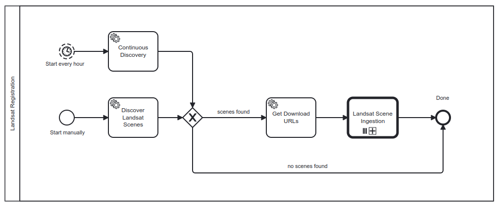
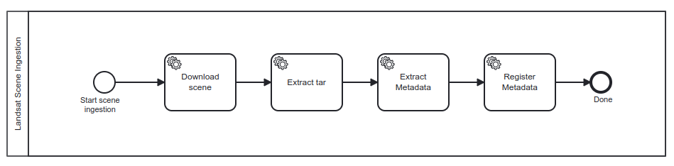
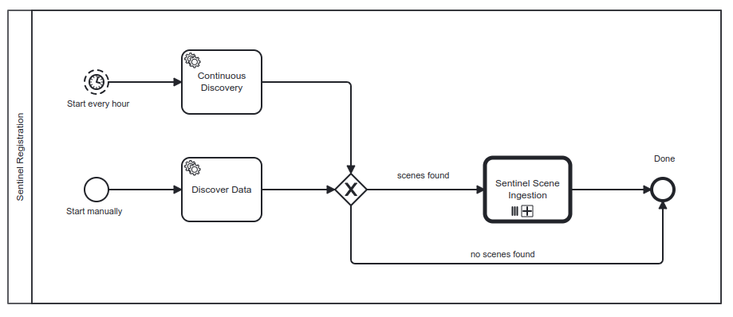
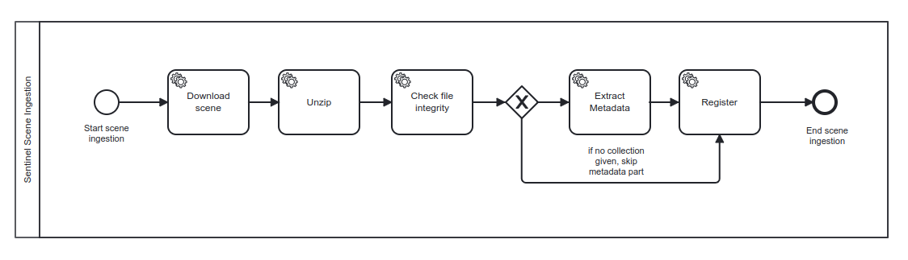

# Harvester - User Guide

## Core Concepts

### Workflow engine

### Workflow definition

### Workflow instance

### Worker

## Built-in workflows

This section describes the workflows which are already implemented in the Harvester component. Please refer to the building block [demo notebook](https://github.com/EOEPCA/demo/blob/main/demoroot/notebooks/06%20Resource%20Registration%20Harvester.ipynb)  for examples how to manage and operate this workflows.

### Landsat

#### Overview

The Landsat workflow consists of two BPMN processes. The main process (Landsat Registration) searches the [Landsat STAC API](https://landsatlook.usgs.gov/stac-server) for new data. For all scenes found, a download URL is requested from the [USGS Machine-to-Machine (M2M)](https://m2m.cr.usgs.gov/) interface. 

Then, the Landsat Scene Ingestion workflow is executed for each scene individually to perform the steps to 

- download the data from USGS, 
- extracting the downloaded file,
- generating the STAC metatdata using the stactools [landsat](https://github.com/stactools-packages/landsat) package and 
- registering the STAC item at the Resource Catalog of the Resource Discovery building block.
 

#### Operation modes

The workflow supports two different operation modes. As it can been in the BPMN diagram, both modes differ in their implementation of the discovery task.

In the *continuous* mode, the workflow is executed automatically every hour by the Flowable workflow engine and the data discovery is done with a shifting time window. The size of the window (default 1 hour) can be set in the workflow configuration together with additional search filters (see below). The main use case of this mode is to perform the systematic EO data provisioning into the exploitation platform.

The *manual* mode is executed when the workflow is exlicitly started by sending a HTTP request to the Flowable REST API. In this case the data discovery solely is based on the filter parameters which are included in the body of the HTTP request. No time window is calculated automatically. This mode can useful in cases, where a certain set of data meeting specific criteria needs to be ingested into the platform.

#### Search parameter

The discovery of scenes at the Landsat STAC API can be parameterized to fit the data requirements of the platform users.

In *manual* mode, the following parameters can be used to filter the search results. Since this mode is triggered by a HTTP request, these parameters must be included in the request body. See the [demo notebook](https://github.com/EOEPCA/demo/blob/main/demoroot/notebooks/06%20Resource%20Registration%20Harvester.ipynb) for details.

| Name | Description | Default | Example |
| ---- | ----------- | --------| ------- |
| collection | Comma-separated list of collection names to search | None | `landsat-c2l2-sr` |
| bbox | Comma-separated list of coordinates representing a bounding box of the search area | None | `8,40,18,60` |
| datetime_interval | A date-time or an interval, open or closed. Date and time expressions adhere to RFC 3339 | None | `2024-11-12T15:00:00Z/2024-11-12T16:00:00Z` |
| query | A query in the syntax of the STAC API [Query](https://github.com/stac-api-extensions/query) extension | None | `"created": {"gte": "2024-12-13T15:00:00.000000Z", "lt": "2024-12-13T16:00:00.000000Z"}}` |

In *continuous* mode, the following parameters can be used. Since this mode is triggered by the workflow engine itself and no HTTP request is involved, these values must be provided in the configuration of the corresponding the worker instance.

| Name | Description | Default | Example |
| ---- | ----------- | --------| ------- |
| collection | Comma-separated list of collection names to search | None | `landsat-c2l2-sr` |
| bbox | Comma-separated list of coordinates representing a bounding box of the search area | None | `8,40,18,60` |
| timewindow_hours | Size of the calculated time window in hours | `1` | `1` |
| datetime_property | STAC property to be used for the time window | `created` | | 

### Sentinel 

#### Overview

The Sentinel harvesting workflow consists of two BPMN processes. The main process (Sentinel Registration) searches the CDSE [OData API](https://documentation.dataspace.copernicus.eu/APIs/OData.html) for new data.

For each new scene discovered, the workflow executes the Sentinel Scene Ingestion process, which performs the following steps:

- download the data from CDSE (using the OData API), 
- unzipping the downloaded file,
- generating the STAC metatdata using the corresponding stactools sentinel package and 
- registering the STAC item at the Resource Catalog of the Resource Discovery building block.

#### Operation modes

The workflow supports two different operation modes. As it can been in the BPMN diagram, both modes differ in their implementation of the discovery task.

In the *continuous* mode, the workflow is executed automatically every hour by the Flowable workflow engine and the data discovery is done with a shifting time window. The size of the window (default 1 hour) can be set in the workflow configuration together with additional search filters (see below). The main use case of this mode is to perform the systematic EO data provisioning into the exploitation platform.

The *manual* mode is executed when the workflow is exlicitly started by sending a HTTP request to the Flowable REST API. In this case the data discovery solely is based on the filter parameters which are included in the body of the HTTP request. No time window is calculated automatically. This mode can useful in cases, where a certain set of data meeting specific criteria needs to be ingested into the platform.

#### Search parameter

The discovery of scenes at the Landsat STAC API can be parameterized to fit the data requirements of the platform users.

In *manual* mode, the following parameters can be used to filter the search results. Since this mode is triggered by a HTTP request, these parameters must be included in the request body. See the [demo notebook](https://github.com/EOEPCA/demo/blob/main/demoroot/notebooks/06%20Resource%20Registration%20Harvester.ipynb) for details.

| Name | Description | Default | Example |
| ---- | ----------- | --------| ------- |
| filter | OData filter expression | None | `(ContentDate/Start ge 2025-01-06T00:00:00.000000Z and ContentDate/Start lt 2025-01-08T00:00:00.000000Z) and (Online eq true)` |
| timewindow_hours | Size of the calculated time window in hours | `1` | `1` |

## Developing custom workflows

This section descibes how to create your own workflow und run it with the Harvester.

### Workflow design
### Worker implementation
### Submitting a workflow definition
### Executing a workflow

