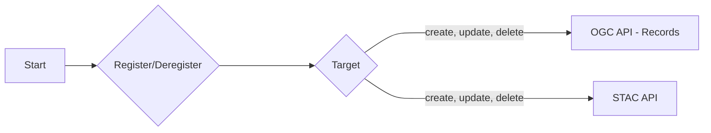

# Registration API - User Guide

Resource registration is managed by the Registration API.  This document will provide an overview of the OGC API - Process standard as well as describe the workflows and interactions to manage resource registration in EOEPCA.

## Introduction

The OGC API -- Processes standard supports the wrapping of
computational tasks into executable processes that can be offered by a
server through a Web API and be invoked by a client application. The
standard specifies a processing interface to communicate over a RESTful
protocol using JavaScript Object Notation (JSON) encodings. The standard
leverages concepts from the OGC Web Processing Service (WPS) 2.0
Interface Standard but does not require implementation of a WPS. The
Core part of the standard is called **OGC API - Processes - Part 1:
Core**. The Core part of the standard supports the wrapping of
computational tasks into executable processes that can be offered by a
server through a Web API and be invoked by a client application either
synchronously or asynchronously. Examples of computational processes
that can be supported by implementations of this specification include
raster algebra, geometry buffering, constructive area geometry, routing,
imagery analysis and several others.

!!! note
    This tutorial module is not intended to be a replacement to the actual
    **OGC API - Processes - Part 1: Core** standard. The tutorial
    intentionally focuses on a subset of capabilities in order to get the
    student started with using the standard. Please refer to the **OGC API -
    Processes - Part 1: Core** standard for additional detail.

### Background

> History

  Several of the concepts specified in OGC API - Processes originated in work specifying a RESTful interface for WPS 2.0. From February 2019 onwards, all work relating to a RESTful interface for the WPS2.0 was changed to focus on OGC API - Processes.

> Versions

  **OGC API - Processes - Part 1: Core** version 1.0.0 is the current latest version

> Test suite

  **Draft** Test suites are available for:

  -   [OGC API - Processes](https://github.com/opengeospatial/ets-ogcapi-processes10)

> Implementations

  Implementations can be found on the [implementations page](https://github.com/opengeospatial/ogcapi-processes/blob/master/implementations.adoc).

#### Usage

**OGC API - Processes - Part 1: Core** supports the wrapping of
computational tasks into executable processes that can be offered by a
server through a Web API and be invoked by a client application.
Government agencies, private organisations and academic institutes use
the OGC API - Processes standard to provide implementations of
geospatial algorithms that process data. The benefit of this is that the
processing of geospatial data, including data from sensors, can be
distributed thereby allowing for more capacity to process larger amounts
of data.

#### Relation to other OGC Standards

-   OGC Web Processing Service Interface Standard (WPS): The WPS
    Standard provides a standard interface that simplifies the task of
    making simple or complex computational geospatial processing
    services accessible via web services. The OGC API --- Processes
    Standard is a newer and more modern way of programming and
    interacting with resources over the web while allowing better
    integration into existing software packages. The OGC
    API --- Processes Standard addresses all of the use cases that were
    addressed by the WPS Standard, while also leveraging the OpenAPI
    specification and a resource-oriented approach.

### Overview of Resources

**OGC API - Processes - Part 1: Core** defines the resources listed in
the following table.

<table>
  <tr>
    <th>Resource</th>
    <th>Method</th>
    <th>Path</th>
    <th>Purpose</th>
  </tr>
  <tr>
    <td>Landing page</td>
    <td>GET</td>
    <td>/</td>
    <td>This is the top-level resource, which serves as an entry point.</td>
  </tr>
  <tr>
    <td>Conformance declaration</td>
    <td>GET</td>
    <td>/conformance</td>
    <td>This resource presents information about the functionality that is implemented by the server.</td>
  </tr>
  <tr>
    <td>API definition</td>
    <td>GET</td>
    <td>/api</td>
    <td>This resource provides metadata about the API itself. Note use of /api on the server is optional and the API definition may be hosted on completely separate server.</td>
  </tr>
  <tr>
    <td>Process list</td>
    <td>GET</td>
    <td>/processes </td>
    <td>Process identifiers, links to process descriptions.</td>
  </tr>
  <tr>
    <td>Process description </td>
    <td>GET</td>
    <td>/processes/{processID}</td>
    <td>Retrieves a process description.</td>
  </tr>
  <tr>
    <td>Process execution</td>
    <td>POST</td>
    <td>/processes/{processID}/execution</td>
    <td>Creates and executes a job.</td>
  </tr>
  <tr>
    <td>Job status info</td>
    <td>GET</td>
    <td>/jobs/{jobID}</td>
    <td>Retrieves information about the status of a job.</td>
  </tr>
    <td>Job results</td>
    <td>GET</td>
    <td>/jobs/{jobID}/results</td>
    <td>Retrieves the resul(s) of a job.</td>
  </tr>
  <tr>
    <td>Job list</td>
    <td>GET</td>
    <td>/jobs</td>
    <td>Retrieves the list of jobs.</td>
  </tr>
  <tr>
    <td>Job deletion</td>
    <td>DELETE</td>
    <td>/jobs/{jobID} </td>
    <td>Cancels and deletes a job.</td>
  </tr>
</table>

### Example

This [demonstration](https://demo.pygeoapi.io/master) server offers and executes various processes through an interface that conforms to OGC API - Processes.

An example request that can be used to browse all the available processes can be found at <https://demo.pygeoapi.io/master/processes>.

Note that the response to the request is HTML in this case.

Alternatively, the same data can be retrieved in GeoJSON format, through the request https://demo.pygeoapi.io/master/processes?f=json

## Resources

### Landing page

Given OGC API - Processes uses OGC API - Common and OGC API - Features as building blocks, please see the [OGC API - Features](https://ogcapi-workshop.ogc.org/api-deep-dive/features/#landing-page) deep dive
for a detailed explanation.

### Conformance declarations

Given OGC API - Processes uses OGC API - Common and OGC API - Features as building blocks, please see the [OGC API - Features](https://ogcapi-workshop.ogc.org/api-deep-dive/features/#conformance-declarations) deep dive
for a detailed explanation.

### API Definition

Given OGC API - Processes OGC API - Common as a building block, please see the [OGC API - Features](https://ogcapi-workshop.ogc.org/api-deep-dive/features/#api-definition) deep dive
for a detailed explanation of an example implementation.

### Process list

Processes offered through an implementation of **OGC API - Processes** are organized into one or more processes.  The `/processes`
endpoint provides information about and access to the list of processes.

For each process, there is a link to the detailed description of the 
process (represented by the path **/processes/{processId}** and 
link relation **self**).  In addition, there are links for executing the
process as well as the list of jobs as a results of executing the process.

Process information also includes whether the process can be run in synchronous
and / or asynchronous mode (job control options).  Asynchronous mode is valuable
for executing long running jobs without blocking the HTTP request/response workflow.
This also means the client can check back for the status of the job as well as the
result once it is completed.

Finally, there are definitions for the input structure required to run the process
(expressed as JSON Schema), as well as the output structure a client should expect
when receiving a response from the process execution.

Below is an extract from the response to the request
<https://demo.pygeoapi.io/master/processes?f=json>

```json
{
    "version": "0.2.0",
    "id": "hello-world",
    "title": "Hello World",
    "description": "An example process that takes a name as input, and echoes it back as output. Intended to demonstrate a simple process with a single literal input.",
    "jobControlOptions":[
        "sync-execute",
        "async-execute"
    ],
    "keywords":[
        "hello world",
        "example",
        "echo"
    ],
    "links":[
        {
            "type": "text/html",
            "rel": "about",
            "title": "information",
            "href": "https://example.org/process",
            "hreflang": "en-US"
        },
        {
            "type": "application/json",
            "rel": "self",
            "href": "https://demo.pygeoapi.io/master/processes/hello-world?f=json",
            "title": "Process description as JSON",
            "hreflang": "en-US"
        },
        {
            "type": "text/html",
            "rel": "alternate",
            "href": "https://demo.pygeoapi.io/master/processes/hello-world?f=html",
            "title": "Process description as HTML",
            "hreflang": "en-US"
        },
        {
            "type": "text/html",
            "rel": "http://www.opengis.net/def/rel/ogc/1.0/job-list",
            "href": "https://demo.pygeoapi.io/master/jobs?f=html",
            "title": "jobs for this process as HTML",
            "hreflang": "en-US"
        },
        {
            "type": "application/json",
            "rel": "http://www.opengis.net/def/rel/ogc/1.0/job-list",
            "href": "https://demo.pygeoapi.io/master/jobs?f=json",
            "title": "jobs for this process as JSON",
            "hreflang": "en-US"
        },
        {
            "type": "application/json",
            "rel": "http://www.opengis.net/def/rel/ogc/1.0/execute",
            "href": "https://demo.pygeoapi.io/master/processes/hello-world/execution?f=json",
            "title": "Execution for this process as JSON",
            "hreflang": "en-US"
        }
    ],
    "inputs":{
        "name":{
            "title": "Name",
            "description": "The name of the person or entity that you wish tobe echoed back as an output",
            "schema":{
                "type": "string"
            },
            "minOccurs":1,
            "maxOccurs":1,
            "metadata":null,
            "keywords":[
                "full name",
                "personal"
            ]
        },
        "message":{
            "title": "Message",
            "description": "An optional message to echo as well",
            "schema":{
                "type": "string"
            },
            "minOccurs":0,
            "maxOccurs":1,
            "metadata":null,
            "keywords":[
                "message"
            ]
        }
    },
    "outputs":{
        "echo":{
            "title": "Hello, world",
            "description": "A \"hello world\" echo with the name and (optional) message submitted for processing",
            "schema":{
                "type": "object",
                "contentMediaType": "application/json"
            }
        }
    },
    "example":{
        "inputs":{
            "name": "World",
            "message": "An optional message."
        }
    },
    "outputTransmission":[
        "value"
    ]
}
```

### Process description

The previous example demonstrated process information for all processes offered by an OGC API - Processes
server.  To access process information for a single process, run the below request against the demo server:

<https://demo.pygeoapi.io/master/processes/hello-world?f=json>

!!! note
    Single process information requires the process identifier as part of the URL

### Process execution

Now that we have the appropriate process information, we can execute the process.  Process execution
requires that requests are run using HTTP POST, with a payload as specified/required by the server (JSON).

!!! note
    Web browsers cannot easily make HTTP POST requests, so we use the [curl](https://curl.se) command.
    You are welcome to use any tool that is able to execute HTTP POST requests per below.

```bash
curl -X POST \
  'https://demo.pygeoapi.io/master/processes/hello-world/execution' \
  -H 'Accept: application/json' \
  -H 'Content-Type: application/json' \
  -d '{
  "inputs": {
    "message": "Great to see you here",
    "name": "OGC API workshop participant"
  }
}'
```

The server will respond with an immediate response (synchronous mode by default) as per below:

```json
{
    "id": "echo",
    "value": "Hello OGC API workshop participant! Great to see you here"
}
```

To execute the same process in asynchronous mode, we need to add the **Prefer: respond-async**
HTTP header.  As well, the response to an ascynchronous process execution is always empty, where
the HTTP **Location** header contains a URL to the resulting job information.


!!! note
    We add the `-v` option to the curl command below to be able to inspect the response headers

```bash
curl -v -X POST \
  'https://demo.pygeoapi.io/master/processes/hello-world/execution' \
  -H 'Prefer: respond-async' \
  -H 'Accept: application/json' \
  -H 'Content-Type: application/json' \
  -d '{
  "inputs": {
    "message": "Great to see you here",
    "name": "OGC API workshop participant"
  }
}'
```

An extract of the response shows the **Location** (location) HTTP header:

```bash
< HTTP/2 201 
< access-control-allow-origin: *
< content-language: en-US
< content-type: application/json
< date: Mon, 04 Dec 2023 16:33:06 GMT
< location: https://demo.pygeoapi.io/master/jobs/cdbc641c-92c2-11ee-9c88-0242ac120003
< preference-applied: respond-async
< server: gunicorn
< x-powered-by: pygeoapi 0.16.dev0
< content-length: 4
```

!!! note
    The URL of the `location` HTTP header will always be unique

### Job status info

Using the URL from the `location` HTTP header above, we can inspect the status of the job:

<https://demo.pygeoapi.io/master/jobs/cdbc641c-92c2-11ee-9c88-0242ac120003?f=json>

```json
{
    "processID": "hello-world",
    "jobID": "cdbc641c-92c2-11ee-9c88-0242ac120003",
    "status": "successful",
    "message": "Job complete",
    "progress":100,
    "parameters":null,
    "job_start_datetime": "2023-12-04T16:33:06.806485Z",
    "job_end_datetime": "2023-12-04T16:33:06.812615Z",
    "links":[
        {
            "href": "https://demo.pygeoapi.io/master/jobs/cdbc641c-92c2-11ee-9c88-0242ac120003/results?f=html",
            "rel": "about",
            "type": "text/html",
            "title": "results of job cdbc641c-92c2-11ee-9c88-0242ac120003 as HTML"
        },
        {
            "href": "https://demo.pygeoapi.io/master/jobs/cdbc641c-92c2-11ee-9c88-0242ac120003/results?f=json",
            "rel": "about",
            "type": "application/json",
            "title": "results of job cdbc641c-92c2-11ee-9c88-0242ac120003 as JSON"
        }
    ]
}
```

### Job results

Here we see that the job is fully executed and complete, but does not contain the actual results.  To inspect
the actual results, we use the link objects which provide the results accordingly:

<https://demo.pygeoapi.io/master/jobs/cdbc641c-92c2-11ee-9c88-0242ac120003/results?f=json>

!!! note
    We see that the the results of the synchronous and asynchronous request/responses are identical, and
    that only the execution control is different.


### Job list

In the same manner that an OGC API - Proceses server provides access to process information for all its
processes, the server provides the same for all of its jobs (from any process) using the following URL:

<https://demo.pygeoapi.io/master/jobs?f=json>

### Job deletion

If we wish to delete a given job, we can execute an HTTP DELETE request agains the the job ID.

!!! note
    Web browsers cannot easily make HTTP DELETE requests, so we use the [curl](https://curl.se) command.
    You are welcome to use any tool that is able to execute HTTP DELETE requests per below.

```bash
curl -X DELETE https://demo.pygeoapi.io/master/jobs/cdbc641c-92c2-11ee-9c88-0242ac120003
```

!!! note
    Try running an HTTP GET on the job that was just deleted and verify that it no longer exists (HTTP 404).

!!! note
    Some servers may implement access control to prevent erroneous or unwanted deletion of a job or
    other resource.

## Summary

The OGC API - Processes standard enables the execution of computing processes and the retrieval of metadata describing the purpose and functionality of the processes. This deep dive provided an introduction to the standard and an overview of its various endpoints, that enable monitoring, creating, updating and deleting those processes on a server.

## Using the Registration API

EOEPCA registration management is realized by using the OGC API - Processes functionality described above.



### Core concepts

#### Request / response HTTP methods and encodings

All processes support **only** HTTP POST with JSON request payloads.  All other HTTP methods and request payload types are not supported and will result in HTTP 405/400 errors.

#### JSON Schemas

Registration API JSON Schemas describe the content models that are within an OGC API - Processes execution payload.  The schemas are available at <https://github.com/EOEPCA/registration-api/blob/master/schemas> and are used as part of runtime request payload validation.

#### Link relations

Link relations are used to describe a given resource type.  The following link relations are supported:

| Link relation | Authority |
| -------- | ------- |
| `collection` | [RFC 6573](https://www.rfc-editor.org/rfc/rfc6573.html) |
| `item` | [RFC 6573](https://www.rfc-editor.org/rfc/rfc6573.html) |
| `http://www.opengis.net/spec/ogcapi-records-1/1.0` | [OGC](https://ogcapi.ogc.org/records) |
| `https://api.stacspec.org/v1.0.0/core` | [STAC](https://github.com/radiantearth/stac-api-spec) |

The Registration API provides two core processes:

- `processes/register`: add/update a resource
- `processes/deregister`: delete a resource

#### Supported resource types

Supported resources include:

- STAC Items ([v1.0.0](https://github.com/radiantearth/stac-spec/blob/v1.0.0/item-spec/item-spec.md), [v1.1.0](https://github.com/radiantearth/stac-spec/blob/v1.1.0/item-spec/item-spec.md))
- STAC Collections ([v1.0.0](https://github.com/radiantearth/stac-spec/blob/v1.0.0/collection-spec/collection-spec.md), [v1.1.0](https://github.com/radiantearth/stac-spec/blob/v1.1.0/collection-spec/collection-spec.md))
- EOEPCA Metadata Profile ([draft](https://github.com/eoepca/metadata-profile))

Resources can be provided in the following ways:

- online resource / link to resource definition
- inline resource definition

#### Supported target APIs

Resources can be sent to the following "target" service endpoint types:

- OGC API - Records - Part 1.0
- STAC API v1.0.0

The Registration API handles all interactions and workflow with targets.  A user need only specify the landing page as part of the register/deregister request payload.

### Registration example requests and responses

#### Registering an inline STAC Collection to an OGC API - Records endpoint

```bash
curl -X POST \
  'https://registration-api.develop.eoepca.org/processes/register/execution' \
  -H 'Accept: application/json' \
  -H 'Content-Type: application/json' \
  -d '{
  "inputs": {
    "source": {
      "content": {
        "id": "simple-collection",
        "type": "Collection",
        "stac_extensions": [
          "https://stac-extensions.github.io/eo/v2.0.0/schema.json",
          "https://stac-extensions.github.io/projection/v2.0.0/schema.json",
          "https://stac-extensions.github.io/view/v1.0.0/schema.json"
        ],
        "stac_version": "1.1.0",
        "description": "A simple collection demonstrating core catalog fields with links to a couple of items",
        "title": "Simple Example Collection",
        "keywords": [
          "simple",
          "example",
          "collection"
        ],
        "providers": [
          {
            "name": "Remote Data, Inc",
            "description": "Producers of awesome spatiotemporal assets",
            "roles": [
              "producer",
              "processor"
            ],
            "url": "http://remotedata.io"
          }
        ],
        "extent": {
          "spatial": {
            "bbox": [
              [
                172.91173669923782,
                1.3438851951615003,
                172.95469614953714,
                1.3690476620161975
              ]
            ]
          },
          "temporal": {
            "interval": [
              [
                "2020-12-11T22:38:32.125Z",
                "2020-12-14T18:02:31.437Z"
              ]
            ]
          }
        },
        "license": "CC-BY-4.0",
        "summaries": {
          "platform": [
            "cool_sat1",
            "cool_sat2"
          ],
          "constellation": [
            "ion"
          ],
          "instruments": [
            "cool_sensor_v1",
            "cool_sensor_v2"
          ],
          "gsd": {
            "minimum": 0.512,
            "maximum": 0.66
          },
          "eo:cloud_cover": {
            "minimum": 1.2,
            "maximum": 1.2
          },
          "proj:cpde": [
            "EPSG:32659"
          ],
          "view:sun_elevation": {
            "minimum": 54.9,
            "maximum": 54.9
          },
          "view:off_nadir": {
            "minimum": 3.8,
            "maximum": 3.8
          },
          "view:sun_azimuth": {
            "minimum": 135.7,
            "maximum": 135.7
          },
          "statistics": {
            "type": "object",
            "properties": {
              "vegetation": {
                "description": "Percentage of pixels that are detected as vegetation, e.g. forests, grasslands, etc.",
                "minimum": 0,
                "maximum": 100
              },
              "water": {
                "description": "Percentage of pixels that are detected as water, e.g. rivers, oceans and ponds.",
                "minimum": 0,
                "maximum": 100
              },
              "urban": {
                "description": "Percentage of pixels that detected as urban, e.g. roads and buildings.",
                "minimum": 0,
                "maximum": 100
              }
            }
          }
        },
        "links": [
          {
            "rel": "root",
            "href": "./collection.json",
            "type": "application/json",
            "title": "Simple Example Collection"
          },
          {
            "rel": "item",
            "href": "./simple-item.json",
            "type": "application/geo+json",
            "title": "Simple Item"
          },
          {
            "rel": "item",
            "href": "./core-item.json",
            "type": "application/geo+json",
            "title": "Core Item"
          },
          {
            "rel": "item",
            "href": "./extended-item.json",
            "type": "application/geo+json",
            "title": "Extended Item"
          },
          {
            "rel": "self",
            "href": "https://raw.githubusercontent.com/radiantearth/stac-spec/v1.1.0/examples/collection.json",
            "type": "application/json"
          }
        ]
      },
      "rel": "collection"
    },
    "target": {
      "href": "https://resource-catalogue.develop.eoepca.org",
      "rel": "http://www.opengis.net/spec/ogcapi-records-1/1.0"
    }
  }
}'
```

#### Registering a remote STAC Collection to an OGC API - Records endpoint

```bash
curl -X POST \
  'https://registration-api.develop.eoepca.org/processes/register/execution' \
  -H 'Accept: application/json' \
  -H 'Content-Type: application/json' \
  -d '{
  "inputs": {
    "source": {
      "href": "https://raw.githubusercontent.com/radiantearth/stac-spec/refs/heads/master/examples/collection.json",
      "rel": "collection"
    },
    "target": {
      "href": "https://resource-catalogue.develop.eoepca.org",
      "rel": "http://www.opengis.net/spec/ogcapi-records-1/1.0"
    }
  }
}'
```

#### Registering an inline STAC Collection to a STAC API endpoint

```bash
curl -X POST \
  'https://registration-api.develop.eoepca.org/processes/register/execution' \
  -H 'Accept: application/json' \
  -H 'Content-Type: application/json' \
  -d '{
  "inputs": {
    "source": {
      "content": {
        "id": "simple-collection",
        "type": "Collection",
        "stac_extensions": [
          "https://stac-extensions.github.io/eo/v2.0.0/schema.json",
          "https://stac-extensions.github.io/projection/v2.0.0/schema.json",
          "https://stac-extensions.github.io/view/v1.0.0/schema.json"
        ],
        "stac_version": "1.1.0",
        "description": "A simple collection demonstrating core catalog fields with links to a couple of items",
        "title": "Simple Example Collection",
        "keywords": [
          "simple",
          "example",
          "collection"
        ],
        "providers": [
          {
            "name": "Remote Data, Inc",
            "description": "Producers of awesome spatiotemporal assets",
            "roles": [
              "producer",
              "processor"
            ],
            "url": "http://remotedata.io"
          }
        ],
        "extent": {
          "spatial": {
            "bbox": [
              [
                172.91173669923782,
                1.3438851951615003,
                172.95469614953714,
                1.3690476620161975
              ]
            ]
          },
          "temporal": {
            "interval": [
              [
                "2020-12-11T22:38:32.125Z",
                "2020-12-14T18:02:31.437Z"
              ]
            ]
          }
        },
        "license": "CC-BY-4.0",
        "summaries": {
          "platform": [
            "cool_sat1",
            "cool_sat2"
          ],
          "constellation": [
            "ion"
          ],
          "instruments": [
            "cool_sensor_v1",
            "cool_sensor_v2"
          ],
          "gsd": {
            "minimum": 0.512,
            "maximum": 0.66
          },
          "eo:cloud_cover": {
            "minimum": 1.2,
            "maximum": 1.2
          },
          "proj:cpde": [
            "EPSG:32659"
          ],
          "view:sun_elevation": {
            "minimum": 54.9,
            "maximum": 54.9
          },
          "view:off_nadir": {
            "minimum": 3.8,
            "maximum": 3.8
          },
          "view:sun_azimuth": {
            "minimum": 135.7,
            "maximum": 135.7
          },
          "statistics": {
            "type": "object",
            "properties": {
              "vegetation": {
                "description": "Percentage of pixels that are detected as vegetation, e.g. forests, grasslands, etc.",
                "minimum": 0,
                "maximum": 100
              },
              "water": {
                "description": "Percentage of pixels that are detected as water, e.g. rivers, oceans and ponds.",
                "minimum": 0,
                "maximum": 100
              },
              "urban": {
                "description": "Percentage of pixels that detected as urban, e.g. roads and buildings.",
                "minimum": 0,
                "maximum": 100
              }
            }
          }
        },
        "links": [
          {
            "rel": "root",
            "href": "./collection.json",
            "type": "application/json",
            "title": "Simple Example Collection"
          },
          {
            "rel": "item",
            "href": "./simple-item.json",
            "type": "application/geo+json",
            "title": "Simple Item"
          },
          {
            "rel": "item",
            "href": "./core-item.json",
            "type": "application/geo+json",
            "title": "Core Item"
          },
          {
            "rel": "item",
            "href": "./extended-item.json",
            "type": "application/geo+json",
            "title": "Extended Item"
          },
          {
            "rel": "self",
            "href": "https://raw.githubusercontent.com/radiantearth/stac-spec/v1.1.0/examples/collection.json",
            "type": "application/json"
          }
        ]
      },
      "rel": "collection"
    },
    "target": {
      "href": "https://eoapi.develop.eoepca.org/stac",
      "rel": "https://api.stacspec.org/v1.0.0/core"
    }
  }
}'
```

#### Registering a remote STAC Collection to a STAC API endpoint

```bash
curl -X POST \
  'https://registration-api.develop.eoepca.org/processes/register/execution' \
  -H 'Accept: application/json' \
  -H 'Content-Type: application/json' \
  -d '{
  "inputs": {
    "source": {
      "href": "https://raw.githubusercontent.com/radiantearth/stac-spec/refs/heads/master/examples/collection.json",
      "rel": "collection"
    },
    "target": {
      "href": "https://eoapi.develop.eoepca.org/stac",
      "rel": "https://api.stacspec.org/v1.0.0/core"
    }
  }
}'
```

#### Registering an inline STAC Item to an OGC API - Records endpoint

```bash
curl -X POST \
  'https://registration-api.develop.eoepca.org/processes/register/execution' \
  -H 'Accept: application/json' \
  -H 'Content-Type: application/json' \
  -d '{
  "inputs": {
    "source": {
      "content": {
        "stac_version": "1.1.0",
        "stac_extensions": [],
        "type": "Feature",
        "id": "20201211_223832_CS2",
        "bbox": [
          172.91173669923782,
          1.3438851951615003,
          172.95469614953714,
          1.3690476620161975
        ],
        "geometry": {
          "type": "Polygon",
          "coordinates": [
            [
              [
                172.91173669923782,
                1.3438851951615003
              ],
              [
                172.95469614953714,
                1.3438851951615003
              ],
              [
                172.95469614953714,
                1.3690476620161975
              ],
              [
                172.91173669923782,
                1.3690476620161975
              ],
              [
                172.91173669923782,
                1.3438851951615003
              ]
            ]
          ]
        },
        "properties": {
          "datetime": "2020-12-11T22:38:32.125000Z"
        },
        "collection": "simple-collection",
        "links": [
          {
            "rel": "collection",
            "href": "./collection.json",
            "type": "application/json",
            "title": "Simple Example Collection"
          },
          {
            "rel": "root",
            "href": "./collection.json",
            "type": "application/json",
            "title": "Simple Example Collection"
          },
          {
            "rel": "parent",
            "href": "./collection.json",
            "type": "application/json",
            "title": "Simple Example Collection"
          }
        ],
        "assets": {
          "visual": {
            "href": "https://storage.googleapis.com/open-cogs/stac-examples/20201211_223832_CS2.tif",
            "type": "image/tiff; application=geotiff; profile=cloud-optimized",
            "title": "3-Band Visual",
            "roles": [
              "visual"
            ]
          },
          "thumbnail": {
            "href": "https://storage.googleapis.com/open-cogs/stac-examples/20201211_223832_CS2.jpg",
            "title": "Thumbnail",
            "type": "image/jpeg",
            "roles": [
              "thumbnail"
            ]
          }
        }
      },
      "rel": "item"
    },
    "target": {
      "href": "https://resource-catalogue.develop.eoepca.org",
      "rel": "http://www.opengis.net/spec/ogcapi-records-1/1.0"
    }
  }
}'
```

#### Registering a remote STAC Item to an OGC API - Records endpoint

```bash
curl -X POST \
  'https://registration-api.develop.eoepca.org/processes/register/execution' \
  -H 'Accept: application/json' \
  -H 'Content-Type: application/json' \
  -d '{
  "inputs": {
    "source": {
      "href": "https://raw.githubusercontent.com/radiantearth/stac-spec/refs/heads/master/examples/simple-item.json",
      "rel": "item"
    },
    "target": {
      "href": "https://resource-catalogue.develop.eoepca.org",
      "rel": "http://www.opengis.net/spec/ogcapi-records-1/1.0",
      "collection": "sentinel-2-l2a"
    }
  }
}'
```

Notes:

- if the STAC Item has a `collection` property, it will be used to add the item to the relevant collection on the OGC API - Records endpoint
- the `collection` property can also be explicitly specified in `target.collection` to override the `collection` property (if defined) in the related STAC Item
- if no collection is defined, the item will be registered to the OGC API - Record `metadata:main` collection

#### Registering an inline STAC Item to a STAC API endpoint

```bash
curl -X POST \
  'https://registration-api.develop.eoepca.org/processes/register/execution' \
  -H 'Accept: application/json' \
  -H 'Content-Type: application/json' \
  -d '{
  "inputs": {
    "source": {
      "content": {
        "stac_version": "1.1.0",
        "stac_extensions": [],
        "type": "Feature",
        "id": "20201211_223832_CS2",
        "bbox": [
          172.91173669923782,
          1.3438851951615003,
          172.95469614953714,
          1.3690476620161975
        ],
        "geometry": {
          "type": "Polygon",
          "coordinates": [
            [
              [
                172.91173669923782,
                1.3438851951615003
              ],
              [
                172.95469614953714,
                1.3438851951615003
              ],
              [
                172.95469614953714,
                1.3690476620161975
              ],
              [
                172.91173669923782,
                1.3690476620161975
              ],
              [
                172.91173669923782,
                1.3438851951615003
              ]
            ]
          ]
        },
        "properties": {
          "datetime": "2020-12-11T22:38:32.125000Z"
        },
        "collection": "simple-collection",
        "links": [
          {
            "rel": "collection",
            "href": "./collection.json",
            "type": "application/json",
            "title": "Simple Example Collection"
          },
          {
            "rel": "root",
            "href": "./collection.json",
            "type": "application/json",
            "title": "Simple Example Collection"
          },
          {
            "rel": "parent",
            "href": "./collection.json",
            "type": "application/json",
            "title": "Simple Example Collection"
          }
        ],
        "assets": {
          "visual": {
            "href": "https://storage.googleapis.com/open-cogs/stac-examples/20201211_223832_CS2.tif",
            "type": "image/tiff; application=geotiff; profile=cloud-optimized",
            "title": "3-Band Visual",
            "roles": [
              "visual"
            ]
          },
          "thumbnail": {
            "href": "https://storage.googleapis.com/open-cogs/stac-examples/20201211_223832_CS2.jpg",
            "title": "Thumbnail",
            "type": "image/jpeg",
            "roles": [
              "thumbnail"
            ]
          }
        }
      },
      "rel": "item"
    },
    "target": {
      "href": "https://eoapi.develop.eoepca.org/stac",
      "rel": "https://api.stacspec.org/v1.0.0/core",
      "collection": "sentinel-2-l2a"
    }
  }
}'
```

#### Registering a remote STAC Item to a STAC API endpoint

```bash
curl -X POST \
  'https://registration-api.develop.eoepca.org/processes/register/execution' \
  -H 'Accept: application/json' \
  -H 'Content-Type: application/json' \
  -d '{
  "inputs": {
    "source": {
      "href": "https://raw.githubusercontent.com/radiantearth/stac-spec/refs/heads/master/examples/simple-item.json",
      "rel": "item"
    },
    "target": {
      "href": "https://eoapi.develop.eoepca.org/stac",
      "rel": "https://api.stacspec.org/v1.0.0/core",
      "collection": "sentinel-2-l2a"
    }
  }
}'
```

Notes:

- if the STAC Item has a `collection` property, it will be used to add the item to the relevant collection on the STAC API endpoint
- the `collection` property can also be explicitly specified in `target.collection` to override the `collection` property (if defined) in the related STAC Item

### Responses

Registration API responses follow the OGC API - Processes standard using standard HTTP status codes and JSON response payloads.

Successful responses return HTTP 200 with the following response payload (example):
```json
{
  "id": "registrar",
  "resource-and-data-catalogue-link": {
    "href": "https://eoapi.develop.eoepca.org/stac/collections/sentinel-2-l2a/items/20201211_223832_CS2",
    "rel": "item",
    "type": "application/geo+json"
  }
}
```

The response payload returns an OGC API link object of the newly registered resource, along with its resource type and media type.

Unsuccessful responses return HTTP 400 with the following response payload (example):

```json
{
  "type": "InvalidParameterValue",
  "code": "InvalidParameterValue",
  "description": "Error executing process: {\"code\":\"CheckViolationError\",\"description\":\"no partition of relation \\\"items\\\" found for row\\nDETAIL:  Partition key of the failing row contains (collection) = (sendtinel-2-l2a).\"}"
}
```

The response payload returns an error type, core and description of the problem detail.

### Deregistration example requests and responses

#### Deregistering any collection from an OGC API - Records endpoint

```bash
curl -X POST \
  'https://registration-api.develop.eoepca.org/processes/register/execution' \
  -H 'accept: application/json' \
  -H 'Content-Type: application/json' \
  -d '{
  "inputs": {
    "id": "my-collection-id",
    "target": {
      "href": "https://resource-catalogue.develop.eoepca.org",
      "rel": "http://www.opengis.net/spec/ogcapi-records-1/1.0"
    }
  }
}'
```

#### Deregistering any collection from a STAC API endpoint

```bash
curl -X POST \
  'https://registration-api.develop.eoepca.org/processes/register/execution' \
  -H 'accept: application/json' \
  -H 'Content-Type: application/json' \
  -d '{
  "inputs": {
    "id": "my-collection-id",
    "target": {
      "href": "https://eoapi.develop.eoepca.org/stac",
      "rel": "https://api.stacspec.org/v1.0.0/core"
    }
  }
}'
```

#### Deregistering any item from an OGC API - Records endpoint

```bash
curl -X POST \
  'https://registration-api.develop.eoepca.org/processes/register/execution' \
  -H 'accept: application/json' \
  -H 'Content-Type: application/json' \
  -d '{
  "inputs": {
    "id": "my-item-id",
    "collection": "my-collection-id",
    "target": {
      "href": "https://resource-catalogue.develop.eoepca.org",
      "rel": "http://www.opengis.net/spec/ogcapi-records-1/1.0"
    }
  }
}'
```

Notes:

- the `inputs.collection` property, specifying the collection identifier, is required for item deregistration

#### Deregistering any item from a STAC API endpoint

```bash
curl -X POST \
  'https://registration-api.develop.eoepca.org/processes/register/execution' \
  -H 'accept: application/json' \
  -H 'Content-Type: application/json' \
  -d '{
  "inputs": {
    "id": "my-item-id",
    "collection": "my-collection-id",
    "target": {
      "href": "https://eoapi.develop.eoepca.org/stac",
      "rel": "https://api.stacspec.org/v1.0.0/core"
    }
  }
}'
```

Notes:

- the `inputs.collection` property, specifying the collection identifier, is required for item deregistration

### Responses

Deregistration API responses follow the OGC API - Processes standard using standard HTTP status codes and JSON response payloads.

Successful responses return HTTP 200 with the following response payload of the deleted resource identifier (example):

```json
{
  "id": "my-collection-id"
}
```

Unsuccessful responses return HTTP 400 with the following response payload (example):

```json
{
  "type": "InvalidParameterValue",
  "code": "InvalidParameterValue",
  "description": "Error executing process: Collection sentinel-2-l2a does not exist."
}
```

The response payload returns an error type, core and description of the problem detail.

